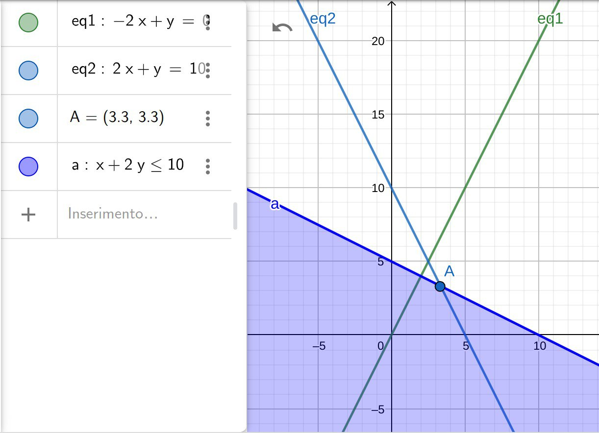

# Esonero scritto PASD - DOMANDE PRIMO ESONERO

## Introduzione a Sistemi a Supporto delle Decisioni ed Intelligenza Artificiale

1. fornire la definizione di decisione strategica, tattica e operative
   > decisione operativa: di breve periodo, reversibili, limitate a n persone nel team

   > decisione tattica: di medio periodo, coinvolge solo una parte del team

   > decisione strategica: di lungo periodo, non reversibile, coinvolge denaro

2. fornire la definizione di decisione strutturata, non strutturata e semi-strutturata
   > decisione strutturata: con procedura di risoluzione specifica

   > decisione non strutturata: richiede creatività e/o esperienza

   > decisione semi-strutturata: usate per descrive solo in parte dei procedimenti standardizzati

3. fornire un esempio di decisione strategica
   > rifornimento di magazzino per l'intero anno 

4. lo scheduling del generatore dell'impianto elettrico è una decisione strategica, tattica o operativa?
   > decisione operativa

5. illustrare la relazione tra decisione stategica e non strutturata
   > dovendo prendere una decisione di lungo periodo e che coninvolge notevoli somme di denaro (strategica) è più ragionevole usare creatività e/o esperienza (non strutturata) 

## Discipline correlate

1. cos'è la Business Intelligence?
   > indica un sistema dedicato alla raccolta di dati e alla loro elaborazione al fine di un reporting (Intelligence). Usato quindi su dati atomici per conoscenze più approfondite

2. cosa sono i Sistemi a Supporto delle Decisioni?
   > indica un sistema computerizzato dotato di un sistema di "data managment" per creare un modello di ottimizzazione

3. qual è la relazione tra Machine Learning e Artificial Intelligence?
   > il Machine Learning è una sottobranca dell'Artificial Intelligence infatti comprende l'apprendimento automatico e l'esperienza pregressa di agenti sottoposti a training. Invece l'Artificial Intelligence comprende tutti i tipi di automazione, dal learning al planning e alla manipolazione dell'ambiente da parte di agenti

4. cosa sono gli Agenti Autonomi?
   > tramite un'istruzione sintetica sviluppa delle azioni per raggiungere il goal cercando di gestire eventuali imprevisti

5. qual è la relazione tra Machine Learning e Data Mining?
   > fanno entrambi parte dell'Artifical Intelligence, il primo di occupa dell'apprendimento automatico e dell'esperienza pregresse di agenti, la seconda studia l'estrazione di pattern dai dati seguendo pattern specifici

6. quale è la relazione tra Data Mining e Knowledge Discovery nei Databases?
   > è un processo automatico per la scoperta di pattern o regole presenti in grandi quantità di dati. Si procede quindi con selezione, pulizia e trasformazione dei dati per poi applicare il Data Mining e la seguente valutazione del pattern

## Ottimizzazione base

1. cos'è una soluzione ammissibile?
   > è una soluzione presente nella regione ammissibile di un proplema. Quest'ultima viene individuata tramite la definizione dei vincoli imposti sul problema, infatti rappresenteranno la delimitazione della nostra regione ammissibile nella quale ci potremo muovere per trovare la soluzione ottima

2. fornire un esempio di soluzione ammissibile del problema senza soluzione ottima
   > unbounded ??????

3. risolvere graficamente il seguente problema di ottimizzazione:
$$\max z = -2x_1 + x_2$$
con vincoli:
- $2x_1 + x_2 = 10$
- $x_1 + 2x_2 \leq 10$
- $x_1, x_2 \geq 0$

## Ottimizzazione del modello

1. descrivere un problema di product-mix
   > un esempio è un'azienda con più installazioni le quali hanno n squadre di m operai che producono x prodotti e bisogna capire come fare a massimizzare i profitti in base al numero di operai e alle ore che investono in un determiato prodotto

2. descrivere il modello di scheduling di un progetto dove la durata di un task dipende dall'importo delle risorse ad esso assegnate e l'obiettivo è ridurre al minimo la durata del progetto subordinatamente a un vincolo di bilancio
   > tenendo conto che il project manager ha un suo budget $x_i$ per poter velocizzare il progetto, bisognare stare attenti alla durata dei tasks $d_i^N$. Il caso ideale è quello lineare nel quale all'aumentare del budget investito si riduce la sua durata in modo lineare, fino ad un vincolo inferiore $d_i^m$. Si fa allora riferimento a 3 risorse: le 3 M (Man, Money, Machine). Quindi la durata del task sarà: $D_i=d_i^N-w_ix_i \geq d_i^m$

3. descrivere il modello EOQ (lot sizing problem)
   > EOQ sarebbe: Economic Order Quantity e indica un modello di gestione delle scorte che definisce la quanità ottima di acquisto per poter minimizzare i costi di approviggionamento e di magazzino

4. descrivere il modello EOQ con un vincolo massimo di inventario
   > ... si dovranno necessareamente applicare dei vincoli di inventario per i prodotti che saranno dati dal volume dell'infrastruttura nella quale sarà conservato il prodotto e/o dai costi che il suo immagazzinamento comporta. Se ipotizzo una domanda costante avremo che il costo annuale sarà:
   $$z = (k_A \frac{d_A}{q_A} + h_A \frac{q_A}{2}) + (k_B \frac{d_B}{q_B} + h_B \frac{q_B}{2})$$
   dove i due termini dipendono dalle variabili $A$ e $B$. Nel caso peggiore produrremo $A$ e $B$ in contemporanea (sovrapposizione dei denti di sega) perciò non dovremo superare:
   $$q_A + a_B \leq Q$$

## Ottimizzazione lineare

1. convertire il seguente problema alla forma standard: ...
   $$min z = 10x_1 - 2x_2$$
   s.t.
   - $x_1 + x_2 + x_3 = 10$
   - $-x_1 + x_2 = 4$
   - $x_2 - x_4 = 2$
   - $y_1 = -x_1 \geq 0$

   allora abbiamo:
   - $-y_1 + x_2 + x_3 = 10$
   - $y_1 + x_2 = 4$
   - $x_2 - x_4 = 2$

   con $\min z = -10y_1 - 2x_2$, ma dato che $x_2$ non è vincolata in segno la sostituisco con 2 variabili di slack: $x_2 = x_2^+ - x+2^-$

   - $-y_1 + x_2^+ - x+2^- + x_3 = 10$
   - $y_1 + x_2^+ - x+2^- = 4$
   - $x_2^+ - x+2^- - x_4 = 2$
   - $y_1, x_2^+, - x+2^-, x_3, x_4  \geq 0$

   con $\min z = -10y_1 -2(x_2^+ - x+2^-)$

2. eseguire un passaggio dell'algoritmo del simplesso: ...
   $$
   \left[ {\begin{array}{cccccc}
      2 & 1 & 1 & 0 & 0 & 100\\
      1 & 1 & 0 & 1 & 0 & 80\\
      1 & 0 & 0 & 0 & 1 & 40\\
      -30 & -20 & 0 & 0 & 0 & 0\\
   \end{array} } \right]
   $$ 
   prendo colonna c=0 come colonna del Pivot dato che ha il numero più negativo e la riga r=2 dato che $\min(\frac{100}{2},\frac{80}{1},\frac{40}{1})=40$. Allora effettuiamo il Pivot su (0,2):
   $$
   \left[ {\begin{array}{cccccc}
      0 & 1 & 1 & 0 & -2 & 20\\
      0 & 1 & 0 & 1 & -1 & 40\\
      1 & 0 & 0 & 0 & 1 & 40\\
      0 & -20 & 0 & 0 & 30 & 120\\
   \end{array} } \right]
   $$ 
3. quante soluzioni di base ha il seguente problema? ...
   $$
   \left[ {\begin{array}{cccccc}
      2 & 1 & 1 & 0 & 0 & 100\\
      1 & 1 & 0 & 1 & 0 & 80\\
      1 & 0 & 0 & 0 & 1 & 40\\
      -30 & -20 & 0 & 0 & 0 & 0\\
   \end{array} } \right]
   $$
   $$I_B=\binom{5}{3}$$

4. descrivere lo pseudocodice dell'algoritmo del simplesso
   1. trovo la BFS
   2. mentre esiste una $\overline{c}_j < 0$ con j variabile non di base $I_N$
      1. trovo argmin per la colonna del Pivot tramite: $\text{argmin} \overline{c}_j$
      2. se $\overline{a}_{is} \leq 0$ -> unbounded
      3. trovo argmin per riga del Pivot tramite: $\text{arming} \frac{\overline{b}_i}{\overline{a}_{is}}$
      4. eseguo il Pivot
      5. se ho una soluzione di base ammissibile ottima esco dal loop
   
5. l'algoritmo del simplesso è convergente? discurre brevemente
   > può essere convergente se non si verifica il cycling. In caso contrario avremo che non convergerà dato che non avremo variazioni di $z$ che infatti resterà costante, senza mai decrescere come normalmente fa, e quindi non procurerà un miglioramento (potrebbe capitare che dopo $n$ iterazioni va a convergere)

6. la funzione obiettivo è monotonicamente crescente/decrescente nell'algoritmo del simplesso? se no, perché?
   > sicuramente non è monotonicamente crescente ma potrebbe essere costante se siamo nel caso di cycling. In alternativa decrescerà quindi andrà a migliorare.

7. cos'è una soluzione di base degenere?
   > se ha una soluzione di base degenere nel momento in cui questa variabile è nulla dato che nella colonna $b$ del tableau avremo uno $0$ come valore associato a quella variabile in base. Questo comporta il cycling ...

8. se una BFS è degenere o non ottima, lo può essere la successiva? vuole un $\Delta z = 0$?
   > non è detto che sia nulla ma se un $\overline{c}_j < 0$ in un'iterazione possiamo migliorare la situazione ma non è detto che non avrò variabili degeneri

9.  guardando il tableau: ... 
    - qual è la soluzione di base associata?
      > per trovarla prendo $I_N=<X,Y>$ e le pongo nulle: $X, Y = 0$. Le variabili in base saranno $I_B=<s_1,s_2>$ con $s_1 = 12$ e $s_2 = 16$

    - è ammissibile?
      > si dato che $s_1, s_2 > 0$

    - è ottima? (assumendo che la funzione obiettivo sia minimizzata)
      > no dato che $X, Y$ hanno valor di costo negativi

    - se non lo è, quali sono le variabili in entrata e in uscita?
      > variabile entrante: $Y$, varaiible uscente: ponendo $\min (3, 5.3)=3$ che equivale alle riga $r=0$ corrispondente a $s_1$ cioè la variabile uscente

    - quale valore prende la variabile in entrata?
      > per capirlo dobbiamo fare il Pivot su $(1,0)$:
      $$
      \left[ {\begin{array}{ccccc}
         0.5  & 1 & 0.25  & 0 & 3\\
         -0.5 & 0 & -0.75 & 1 & 7\\
         0   & 0 & 0.5   & 0 & 6\\
      \end{array} } \right]
      $$ 

10. guardando il tableau: ...
    - il BFS è ottimo? (assumendo che la funzione obiettivo sia minimizzata)
      > si dato che non abbiamo valori di $\overline{c}_j < 0$

    - se lo è, la soluzione ottima è unica?
      > no, dato che la variabile non in base $x_2$ ha $\overline{c}_j = 0$

    - se non lo è, qual è un'altra BFS ottima? e qual è una soluzione ottima che non sia BFS?
      > se faccio il Pivot sulla variabile non in base ed entra in base, abbiamo una BFS ma avendo $\overline{c}_j = 0$ allora $\Delta z = 0$

      x2 puo cresce (creando infinite soluzioni, ma la osluizione ottima rimane solo una) quanto ci pare ma x3 e x1 restano >= 0 e contemporaneamente Delta z = 0 * x2

11. usando il metodo delle variabili artificiali eseguire una sua iterazione sul seguente problema: ...
   Standardizzo:
   $$\min z = 2x_1 + x_2$$
   s.t
   - $x_1 - x_2 - x_3 = 1$
   - $-x_1 + x_2 \geq 1\ \ \ \Rightarrow\ \ \ -x_1 + x_2 -x_4 = 1$
   - $x_1, x_2, x_3, x_4 \geq 0$
  
   Variabili artificiali:
   $$\min \rho = \alpha_1 + \alpha_2$$
   s.t
   - $x_1 - x_2 - x_3 + \alpha_1 = 1$
   - $-x_1 + x_2 - x_4 + \alpha_2 = 1$
   - $x_1, x_2, x_3, x_4, \alpha_1, \alpha_2 \geq 0$ 

   $$
   \left[ {\begin{array}{ccccccc}
      1  & -1 & -1 & 0  & 1 & 0 & 1\\
      -1 & 1  & 0  & -1 & 0 & 1 & 1 \\
      2  & 1  & 0  & 0  & 0 & 0 & 0 \\
   \end{array} } \right]
   $$ 

   Soluzione ottima

## Algoritmo Branch-and-Bound

1. descrivere lo peseudocodice branch and bound (ricerca del bound migliore)
   - L := {P } // lista dei sottoproblemi da analizzare
   - zbest := −∞
   - xbest := NULL
   - while L e` vuoto:
      - estrarre un sottoproblema k da L
      - branching da 1 → nk
      - risolvo R(P) e trovo i limiti e l’upperbound UB - - for i = 1 to nk:
         - if UBi ≤ zbest then:
           - kill childi
         - elif R(P) e` una soluzione intera:
           - zbest := UBi
           - xbest := childi
         - elif R(P) e` una soluzione frazionaria:
           - add childi to L
   - end for end while

## Ottimizzzione lineare intera (mix)

1. descrivere lo pseudocodice dell'algoritmo di Branch-and-Bound (ricerca del bound migliore)
   - $L$: contenitore per i sottoproblemi
   - $z^{best} = -\infty$
   - $x^{best} = NULL$
   - while $L$ è vuoto:
     1. estraggo sottoproblema $k$ da $L$
     2. branch
     3. risolvo $R(P)$ e trovo upperbound $UB$
     4. for $i = 1,...,n_k$
        1. if $UB_i \leq z^{best}$: kill child
        2. elif $R(P)$ ha sol. intera: $z^{best}=UB,\ x^{best}=child$
        3. elif $R(P)$ ha sol. frazionaria: add child in $L$
   
2. nell'algortimo di Branch-and-Bound quando un sottoproblema può essere preso in considerazione?
   > qunado ha l'upperbound $z$ maggiore dell'altro sottoproblema

3. applicare il metodo Branch-and-Bound al seguente problema e risolvere graficamente i rilassamenti: ...
   > ...

4. considerando il seguente problema di ottimizzazione lineare intera e i suoi rilassamenti ... eseguire uno step dell'algoritmo di Branch-and-Bound
   > ...

## Euristica costruttiva
1) Descrivi lo pseudocodice dell'algoritmo greedy
   - last = 1 (last = ultimo punto toccato)
   - S = {2,3,...,n}
   - while (S ̸= insieme vuoto)
      - estrarre da S un punto
         - i = argmin c_last,i
         - succlast = i
         - last = i
   - succlast = 1
  
2) Fornire lo pseudocodice dell'algoritmo relax-and-fix
    - found=true
    - for(k=1→n):
    - solvePk(x1,...,xk−1)
    - if e` inammissibile:
        - found = false
        - break;
    - else: (x′k+1, ..., x′n) e` soluzione fissare xk = x′k

3) Descrivere l'algoritmo dell'orizzonte mobile
   > al posto di trovare una soluzione per n variabili, prendo un sottoproblema di k variabili e risolvendolo fisso $x_1$ e poi continuo a risolvere non entendo conto delle variabili fissate.

4) Dato un TSP determinare una soluzione fattibile con un algoritmo avido con n = 4 e
$$C=
   \left[ {\begin{array}{cccc}
      0 & 10 & 5 & 2 \\
      10 & 0 & 7 & 3 \\
      5 & 5 & 0 & 1 \\
      2 & 2 & 3 & 0 \\
   \end{array} } \right]
   $$

## Ottimizzazione multiobiettivo
1) Che cos'è una soluzione di Pareto?
   > è una soluzione che domina tutte le altre

2) Qual è il metodo dei vincoli?
   > ci permette di risolvere dei problemi con più f.o andando a sceglierne solo una ed imponendo dei vincoli sulle altre in base alle nostre necessità

3) Qual è il metodo del peso?
   > ci permette di risolvere dei problemi con più f.o andadno a sommarle tutte in una unica

4) Descrivi il metodo a priori:
   > 

5) Dati due obiettivi (z1 da massimizzare e z2 da minimizzare) e soluzioni fattibili ...
   > ottimo individuale (max) rispetto a z1 è E(-5, -1000)
   > ottimo individuale (min) rispetto a z2 è E(-5, -1000)
   > abbiamo allora una superior soluzion dato che domina tutte le altre soluzioni
